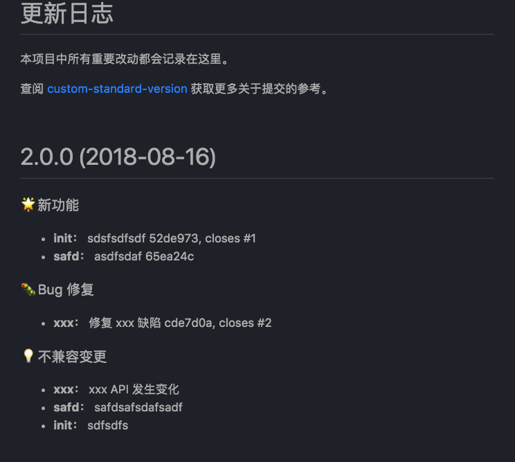

# conventional-changelog-uedlinker

[![NPM version][npm-image]][npm-url]

> [conventional-changelog](https://github.com/ajoslin/conventional-changelog) [uedlinker](https://github.com/angular/angular) 预设

配合 [custom-standard-version](https://github.com/RunningCoderLee/custom-standard-version) 工具使用，创建和更新 `CHANGELOG`

也支持 `conventional-chanlog` 生态圈中可以自定义预设（preset）的其他工具

## 使用

全局安装

```shell
$ npm i -g custom-standard-version @uedlinker/conventional-changelog-uedlinker
```

本地安装

```shell
$ npm i -D custom-standard-version @uedlinker/conventional-changelog-uedlinker
```

**注意：** 确保此预设和 `custom-standard-version` 工具安装在同一作用域

## 示例

使用 `custom-standard-version` 工具和此预设生成的 `CHANGELOG` 如下



## 提交规范格式

参考[这里](https://github.com/uedlinker/conventional-changelog/blob/master/packages/commitlint-config/README.md#%E6%8F%90%E4%BA%A4%E8%A7%84%E8%8C%83)

[npm-image]: https://img.shields.io/npm/v/@uedlinker/conventional-changelog-uedlinker.svg?style=flat
[npm-url]: https://www.npmjs.com/package/@uedlinker/conventional-changelog-uedlinker
[travis-image]: https://travis-ci.org/conventional-changelog/conventional-changelog-angular.svg?branch=master
[travis-url]: https://travis-ci.org/conventional-changelog/conventional-changelog-angular
[daviddm-image]: https://david-dm.org/conventional-changelog/conventional-changelog-angular.svg?theme=shields.io
[daviddm-url]: https://david-dm.org/conventional-changelog/conventional-changelog-angular
[coveralls-image]: https://coveralls.io/repos/conventional-changelog/conventional-changelog-angular/badge.svg
[coveralls-url]: https://coveralls.io/r/conventional-changelog/conventional-changelog-angular