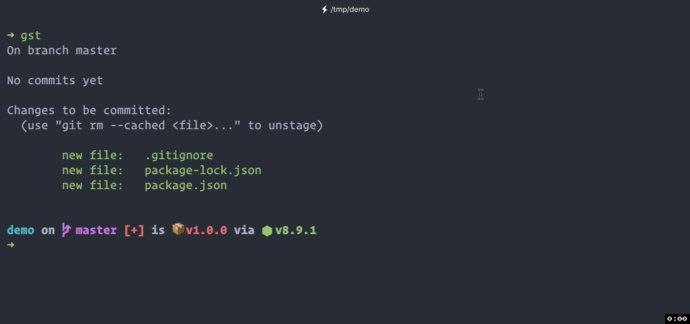

# cz-conventional-changelog

根据 Angular git commit 提交规范定制的适配器

Status:
[](https://www.npmjs.org/package/cz-conventional-changelog)
[](https://travis-ci.org/uedlinker/cz-conventional-changelog)

[commitizen](https://github.com/commitizen/cz-cli) 家族的一部分， 提示定制化后的 [conventional changelog](https://github.com/conventional-changelog/conventional-changelog) 标准。

先来看看效果



## 使用

该工具有 2 种使用方法，一种是`项目配置`，另一种是`个人配置`。

### 命令行工具

如果想直接用`git cz` 代替 `git commit` ，需要全局安装 `commitizen` 或者 使用 `npx git cz` (**NPM 5.2+**)

```shell
$ npm i -g commitizen
$ git cz
```

或

```shell
$ npx git cz
```

如果只想在特定项目中使用，则需要在安装了 `commitizen` 模块的项目中配置 `npm script` 

```JSON
{
  "script": {
    "commit": "git-cz"
  }
}
```

配置完成后每次提交时执行如下命令即可

```shell
$ npm run commit
```

> **注意：** 如果你因为使用 `husky` 这样的工具而附带使用了 `precommit` 这样的钩子，你需要将脚本命名为除“commit”之外的其他名称（例如“cm”：“git-cz”）。因为 `npm-scripts` 有一个“特性”，它在运行`xxx`名称的脚本时会自动运行名称为 `prexxx` 的脚本。实际上，如果你将脚本命名为 “commit”，则 npm 和 husky 将运行两次 “precommit” 脚本，解决方法就是通过更改名称来阻止 npm 触发的 precommit 脚本。

### 项目配置

直接在项目的 `package.json` 中配置好，所有参与此项目的开发人员只需正常安装所有依赖包，在提交 `git commit` 的时候用 `git cz` 或配置好的 `npm script` 来代替 `git commit` 命令即可

此方法 **优点** 是单点维护，所有变更和依赖包升级都根据项目进行变化，开发者不需要关心，减轻开发人员设置工作，**缺点** 如果是通过 `npm script` 运行，则脱离此项目后无法在别的项目中使用

#### 配置适配器

执行如下命令配置所用的适配器

如果你的 **NPM 5.2+** ，你可以直接通过 [`npx`](https://medium.com/@maybekatz/introducing-npx-an-npm-package-runner-55f7d4bd282b) 进行初始化

```shell
$ npx commitizen init @uedlinker/cz-conventional-changelog --save-dev --save-exact
```

如果你的 **NPM 版本 < 5.2**，你可以执行如下命令进行配置

如果已全局安装 `commitizen`

```shell
$ commitizen init @uedlinker/cz-conventional-changelog --save-dev --save-exact
```

如果在项目中安装 `commitizen`

```shell
$ ./node_modules/.bin/commitizen init @uedlinker/cz-conventional-changelog --save-dev --save-exact
```

上面的命令帮助我们做了下面 3 件事。

1. 安装 npm 模块 `@uedlinker/cz-conventional-changelog`
2. 在 `package.json` 文件中的 `dependencies` 或 `devDependencies` 保存依赖包信息
3. 在 `package.json` 文件中的根节点上添加 `config.commitizen` 节点信息，如下：

```JSON
{
  ...
  "config": {
    "commitizen": {
      "path": "./node_modules/@uedlinker/cz-conventional-changelog"
    }
  }
}
```

上面的配置用来告知 `commitizen` 用哪一个适配器来提交这个仓库的 commit ， `commitizen.path` 通过 [require.resolve](https://nodejs.org/api/globals.html#globals_require_resolve) 解决路径的读取并支持如下特性：

* npm 模块
* 相对于 `index.js` 的文件
* 相对于根目录（`process.cwd()`）的以 `js` 作为扩展名的文件名称
* 完整的相对路径
* 绝对路径

初始化结束之后即可用 `git cz` 或配置好的 `npm script` 来代替 `git commit` 命令

### 个人配置

通过在个人电脑上全局安装所需依赖包和设置适配器，配置好之后即可正常使用 `git cz` 命令

此方法 **优点** 是设置不受具体项目影响，设置好之后即可在各项目中使用 `git cz` 命令，**缺点** 是需要每个开发者对自己的环境进行配置，同时如果多个项目之间使用的适配器版本不同的话还存在冲突的可能性

#### 安装

全局安装 `commitizen` 和 `@uedlinker/cz-conventional-changelog`

```shell
$ npm install -g commitizen @uedlinker/cz-conventional-changelog
```

#### 配置适配器

在 `home` 文件夹中创建 `.czrc` 文件，路径引用全局安装的 `commitizen 适配器`

> windos 下暂时还未测试应该创建在哪个文件夹下，欢迎测试后完善此处内容

```shell
$ echo '{ "path": "@uedlinker/cz-conventional-changelog" }' > ~/.czrc
```

配置成功后，凡是需要使用 `git commit` 提交的时候一律改为 `git cz` 即可。
